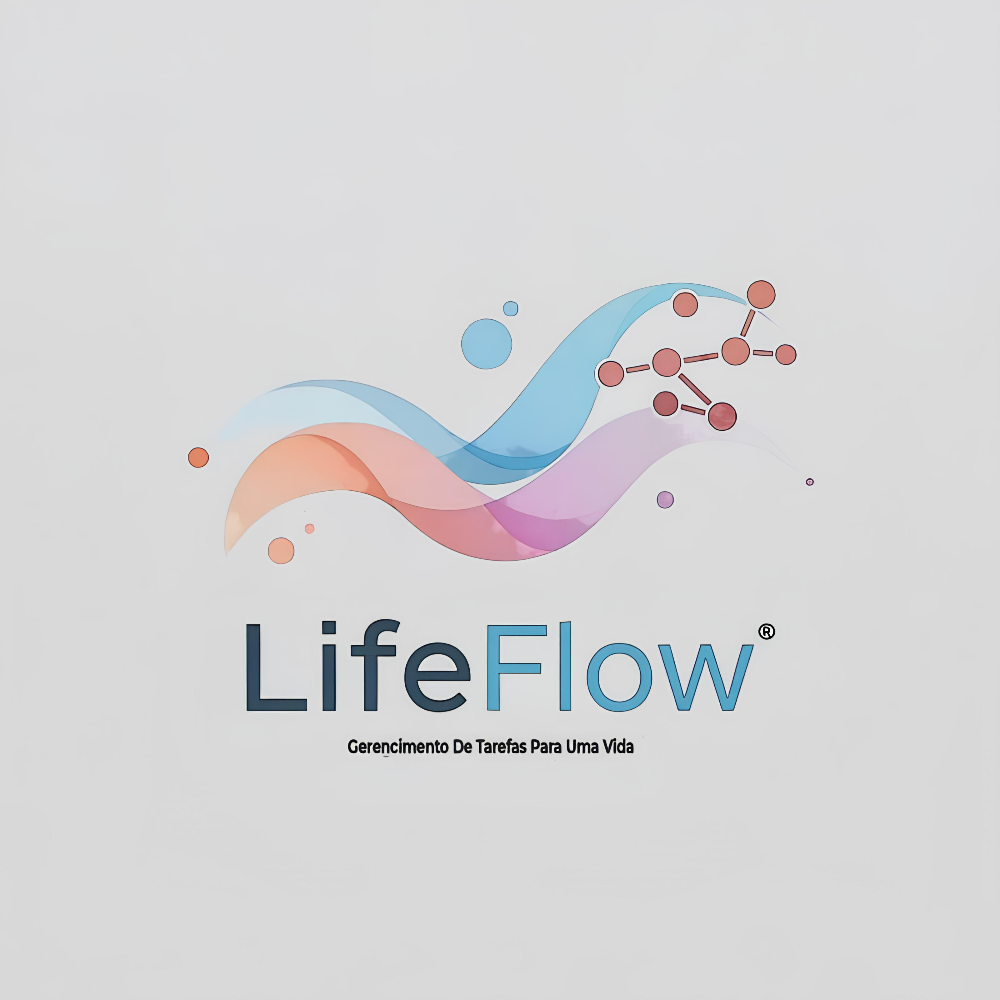

# LifeFlow: Seu Gerenciador Pessoal de Tarefas e Anotações

<p align="center">
  
</p>

LifeFlow é um aplicativo web leve e intuitivo desenvolvido para ajudar você a organizar suas tarefas e anotações de forma eficiente.
Com uma interface simples e funcionalidades essenciais, o LifeFlow permite que você mantenha o controle de suas atividades diárias e
informações importantes em um só lugar.

## Funcionalidades Principais

* **Autenticação de Usuário:**
    * Registro de novas contas.
    * Login seguro para usuários existentes.
    * Gerenciamento de sessão para acesso personalizado.

* **Gerenciamento de Tarefas (CRUD):**
    * **C**riar novas tarefas com título, descrição, data de vencimento e nível de importância (Baixa, Média, Alta).
    * **R**ealizar a leitura e visualização de todas as tarefas cadastradas.
    * **U**pdate (Atualizar) tarefas existentes, alterando seus detalhes.
    * **D**eletar tarefas que não são mais necessárias.
    * Visualização de tarefas por importância (com destaque visual por cor).

* **Gerenciamento de Anotações (CRUD):**
    * **C**riar novas anotações com título e conteúdo.
    * **R**ealizar a leitura e visualização de todas as anotações.
    * **U**pdate (Atualizar) anotações existentes.
    * **D**eletar anotações.

## Tecnologias Utilizadas

O LifeFlow foi construído com as seguintes tecnologias:

* **Backend:**
    * **Python 3.x:** Linguagem de programação principal.
    * **Flask:** Microframework web Python, para a construção da API e manipulação das requisições.
    * **SQLite:** Banco de dados leve e embutido para armazenamento das informações de usuários, tarefas e notas.
    * **Werkzeug Security:** Utilizada para o hashing seguro de senhas.

* **Frontend:**
    * **HTML5:** Para a estrutura das páginas web.
    * **CSS3:** Para a estilização e design da interface.
    * **Bootstrap 5.3:** Framework CSS para responsividade e componentes pré-estilizados.
    * **Jinja2:** Motor de templates do Flask para renderização dinâmica das páginas HTML.

## Estrutura do Projeto
A estrutura do projeto está organizada da seguinte forma:

lifeflow/
│── app.py            
│── models.py         
│── routes/          
│   │── auth.py       
│   │── tasks.py       
│   │── notes.py       
│── templates/         
│   │── base.html      
│   │── dashboard.html 
│   │── login.html     
│   │── notes.html     
│   │── register.html  
│   │── tasks.html     
│── static/            
│   │── style.css      
│   │── img/           
│       │── flow.jpeg
│       │── favicon-32x32.png
│── database.db       
└── README.md          

## Como Executar o Projeto

Siga os passos abaixo para configurar e executar o LifeFlow em seu ambiente local:

1.  **Clone o repositório:**
    ```bash
    git clone https://github.com/FelipeT1tto/ProjetoTarefa.git
    cd lifeflow
    ```

2.  **Crie e ative um ambiente virtual (recomendado):**
    ```bash
    python -m venv venv
    # No Windows:
    .\venv\Scripts\activate
    # No macOS/Linux:
    source venv/bin/activate
    ```

3.  **Instale as dependências:**
    ```bash
    pip install Flask Werkzeug
    ```
    *(É uma boa prática criar um `requirements.txt` com `pip freeze > requirements.txt` e instalar com `pip install -r requirements.txt`)*

4.  **Execute o aplicativo:**
    ```bash
    python app.py
    ```

5.  **Acesse o aplicativo:**
    Abra seu navegador e acesse `http://127.0.0.1:5000/`.

## Contribuição

Contribuições são bem-vindas! Se você tiver sugestões, melhorias ou encontrar algum bug, sinta-se à vontade para abrir uma issue ou enviar um pull request.

## Autores

* Felipe Titto de Siqueira
* Gabriel Nascimento de Souza
* Vinicius da Silva Cardoso

